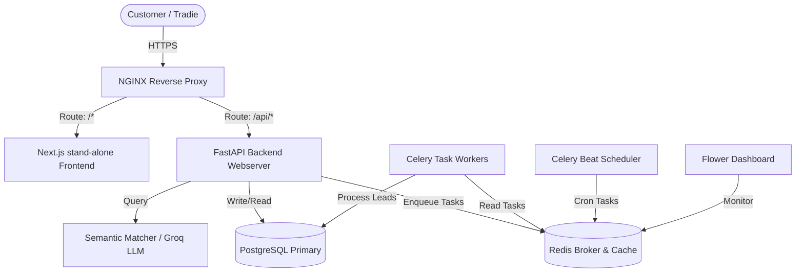

# ProConnect — System Architecture Documentation

This document describes the high-level system architecture, design patterns, and engineering implementations of the **ProConnect** platform (a premier Australian marketplace matching consumers with licensed tradespeople).

---

## 🏗️ Architectural Overview

ProConnect is built as an enterprise-grade service-oriented application utilizing a robust multi-container stack:



### Key Components:
1. **NGINX:** Acts as the reverse proxy, load balancer, and TLS termination point.
2. **Next.js Frontend:** A highly premium standalone React web application implementing responsive views for both consumers (job posting) and tradies (lead management).
3. **FastAPI Backend:** High-performance ASGI Python backend containing all business logic, WebSocket channels, payment processing integrations, and AI matching interfaces.
4. **Celery Worker & Scheduler:** Coordinates background processing including lead matching, SMS/email alerts, payment verification, and automated dispute escalations.
5. **PostgreSQL:** Reliable relational store utilizing SQLAlchemy's unified asyncio interface for high throughput.
6. **Redis:** Dual-purpose high-speed in-memory database operating as the Celery task broker and backend cache.

---

## 📁 System Core Layers

The backend follows an enterprise-level domain-driven layered architecture:

```
backend/
├── alembic/             # Database migration history & versions
├── db/                  # DB Session management & engine initialization
├── middleware/          # Cors, rate limiting, request logging middlewares
├── models/              # Declarative SQLAlchemy models (declarative base)
├── schemas/             # Pydantic validation & serialisation models
├── routers/             # Web API controllers (auth, jobs, leads, admin, etc.)
├── services/            # Pure domain service layer (matching, payment, R2)
├── tasks/               # Background task definitions (Celery)
└── workers/             # Celery application instantiation
```

---

## 🤖 Semantic Lead Matching Algorithm

A central feature of the ProConnect platform is the automated, semantic matching of customer jobs to registered tradies.

### The Problem:
Customers describe issues in natural language (e.g., *"My kitchen sink is overflowing and leaking on the carpet"*). Tradies register for standard services (e.g., *"Emergency Plumbing"*). Simple keyword search fails here.

### The Solution:
ProConnect utilizes a two-step semantic processing flow:
1. **LLM Extraction:** When a job is posted, the user's natural language input is dispatched to the `Groq/LLM Service`. The service parses the description and extracts standard categories and tags.
2. **Database Mapping:** A structured query intersects:
   - Extracted job categories and geolocation radius.
   - The tradies' registered service offerings, licensing status, and service range.
3. **Automated Lead Dispatch:** Once matching tradies are found, a background Celery task creates a direct lead invite for those tradies, immediately pushing real-time alerts.

---

## 🔐 Security & Multi-Tenancy

ProConnect enforces comprehensive security measures across all layers:

1. **Role-Based Access Control (RBAC):** Users are clearly segmented into `customer`, `tradie`, and `admin` scopes. Endpoint dependencies verify roles before serving requests.
2. **JWT-Based Authentication:** Tokens are signed using high-entropy keys with short lifespans.
3. **In-Depth IDOR Mitigation:** Database queries do not rely solely on input IDs. They enforce ownership checks (e.g., a tradie can only view leads explicitly assigned to their ID, and customers can only update jobs they created).
4. **Secure Admin Boundary:** The admin panel lives inside the standalone frontend but communicates only with secured admin endpoints on the backend that check strict admin-level signatures and role headers.

---

## 🚀 Production Optimization Checklist

- **Next.js Standalone Build:** The frontend is configured with `output: "standalone"` in `next.config.mjs`, stripping out unneeded dependencies to reduce the production image from ~500MB to ~80MB.
- **Python Multi-stage Builder:** The backend Dockerfile uses a compiler stage to build wheels, leaving behind all compilation tools (gcc, headers) to keep the runtime image lean and secure.
- **Root-privilege Mitigation:** All containers execute under custom non-root system users (`appuser` in the backend, `nextjs` in the frontend) to prevent container escape exploits.
