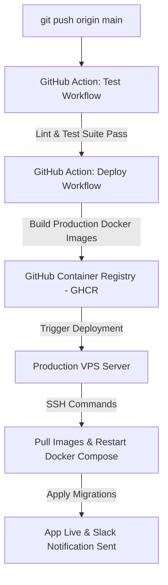

# ProConnect — Production Deployment Guide

This document outlines the deployment processes, CI/CD pipeline, and production server setup requirements for the **ProConnect** application suite.

---

## 🚀 CI/CD Pipeline Flow

ProConnect leverages **GitHub Actions** for robust, fully automated deployments on every merge to the `main` branch:



---

## 🖥️ Server System Requirements

To host the ProConnect stack, the standard target machine is a VPS running a modern Linux distro:

* **OS:** Ubuntu 22.04 LTS or newer
* **Specs:** Minimum 2 CPU Cores, 4GB RAM (8GB recommended for production under load)
* **Software:** Docker Engine v25+, Docker Compose v2.20+, OpenSSH-Server

---

## 🛠️ Server Initial Provisioning

Execute the following commands on a freshly provisioned Ubuntu server:

```bash
# 1. Update system packages
sudo apt update && sudo apt upgrade -y

# 2. Install Docker
sudo apt install -y curl gnupg lsb-release
sudo mkdir -p /etc/apt/keyrings
curl -fsSL https://download.docker.com/linux/ubuntu/gpg | sudo gpg --dearmor -o /etc/apt/keyrings/docker.gpg
echo "deb [arch=$(dpkg --print-architecture) signed-by=/etc/apt/keyrings/docker.gpg] https://download.docker.com/linux/ubuntu $(lsb_release -cs) stable" | sudo tee /etc/apt/sources.list.d/docker.list > /dev/null
sudo apt update
sudo apt install -y docker-ce docker-ce-cli containerd.io docker-compose-plugin

# 3. Add deployer user to docker group
sudo usermod -aG docker deploy
```

---

## 🔑 Production Environment Configuration

Create the directory `/app/proconnect/` on your server and save your production secrets inside `/app/proconnect/.env`:

```env
# =============================================================================
# PRODUCTION ENVIRONMENT VARIABLE CONFIGURATION
# =============================================================================
PROJECT_NAME="ProConnect"
ENVIRONMENT=production
SECRET_KEY=highly-secure-cryptographic-random-hex-key

# Database Connectivity
POSTGRES_USER=proconnect_admin
POSTGRES_PASSWORD=use-a-strong-random-password-here
POSTGRES_DB=proconnect_prod
POSTGRES_HOST=postgres
POSTGRES_PORT=5432

# Redis Connectivity
REDIS_HOST=redis
REDIS_PORT=6379

# AI Matching Integration
GROQ_API_KEY=gsk_your-production-groq-key-here

# Storage Services
R2_ACCOUNT_ID=cloudflare-r2-account-id
R2_ACCESS_KEY_ID=r2-access-key-id
R2_SECRET_ACCESS_KEY=r2-secret-access-key
R2_BUCKET_NAME=proconnect-images
R2_PUBLIC_URL=https://images.proconnect.com.au

# Monitoring
SENTRY_DSN=https://your-sentry-dsn
```

---

## 🔄 Database Migrations & Backups

### Production DB Migrations
Migrations are applied automatically during deployment via the `deploy.sh` script using Docker:
```bash
docker compose -f docker-compose.prod.yml exec -T fastapi alembic upgrade head
```

### Production Daily Backups
Configure a cron job on the host system to run a pg_dump backup once per day:

Create `/etc/cron.daily/backup-postgres`:
```bash
#!/bin/bash
BACKUP_DIR="/var/backups/proconnect"
TIMESTAMP=$(date +"%Y%m%d_%H%M%S")
mkdir -p "$BACKUP_DIR"
docker exec proconnect-postgres-1 pg_dump -U proconnect_admin proconnect_prod | gzip > "$BACKUP_DIR/db_backup_$TIMESTAMP.sql.gz"
# Keep only the last 30 days of backups
find "$BACKUP_DIR" -type f -mtime +30 -name "*.sql.gz" -delete
```
Make it executable:
```bash
chmod +x /etc/cron.daily/backup-postgres
```

---

## 🔍 Monitoring & Alerts

1. **Sentry Dashboard:** Tracks unhandled exceptions, memory leaks, and performance spikes across both the FastAPI backend and Next.js frontend in real-time.
2. **Celery Flower Dashboard:** Accessible on port `5555` behind an Nginx basic authentication wall. Monitor background worker concurrency and lead delivery queues.
3. **Slack Webhook Notifications:** Our CI/CD pipeline triggers automated alerts to the engineering Slack channel indicating the git hash, build status, and execution duration of any production deployment.
